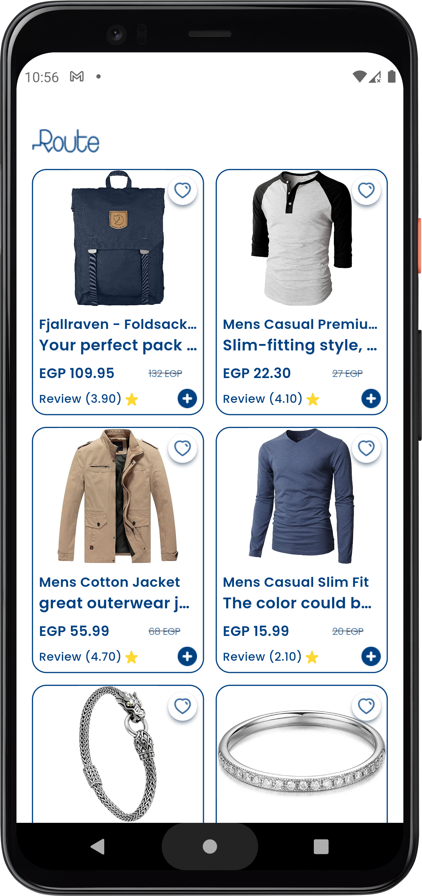
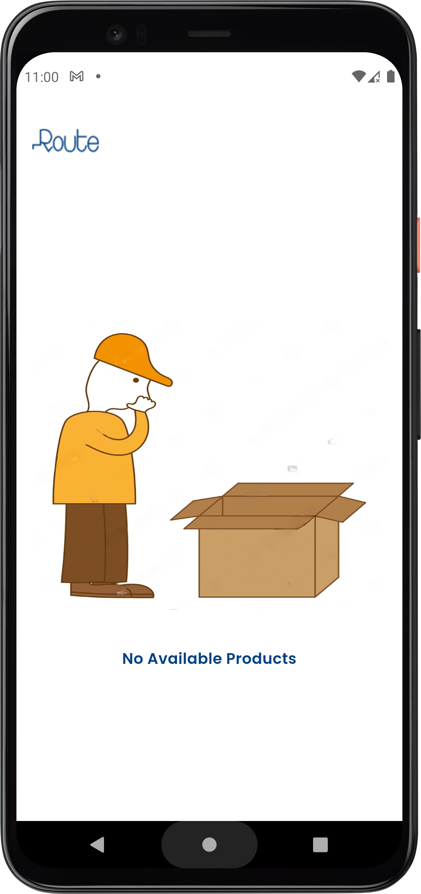
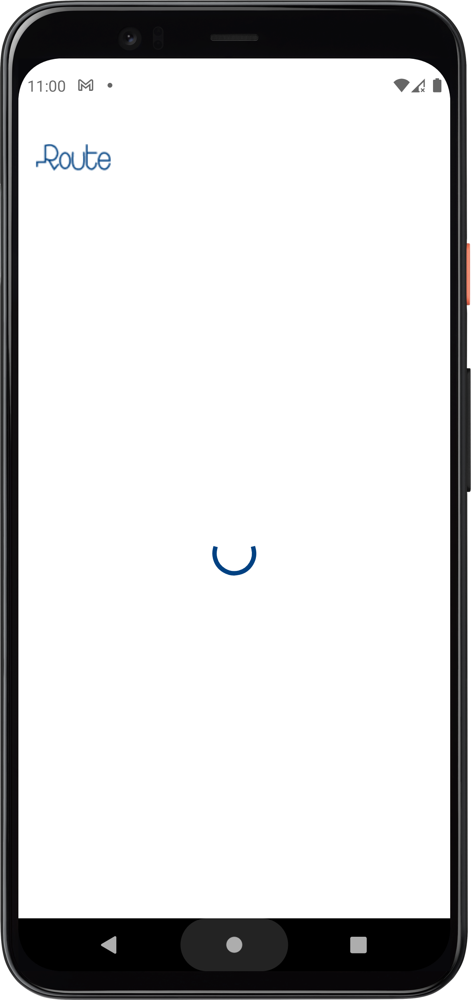
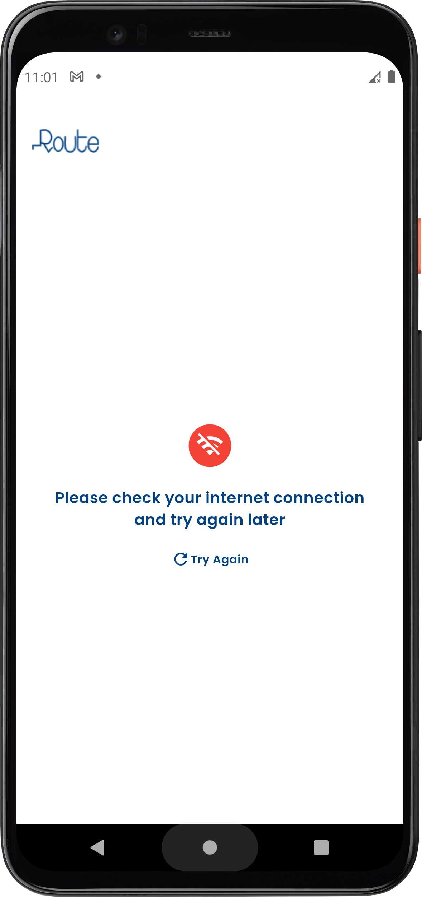

# Products Screen
This is a Flutter implementation of a products screen, following the principles of MVVM (Model-View-ViewModel), Cubit, and Dependency Injection in a clean architecture.

# Features
- Displays a list of products
- Fetches the product data from a repository
- Separates the concerns between the ViewModel, Repository, and the UI code

  
  
  
  

